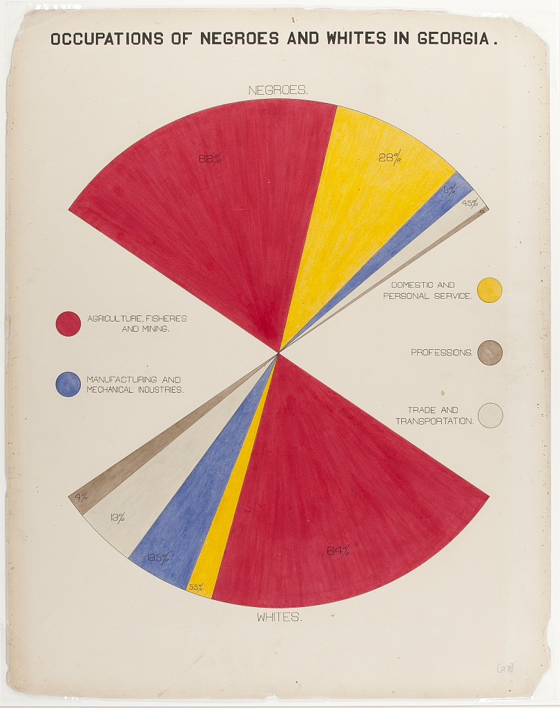
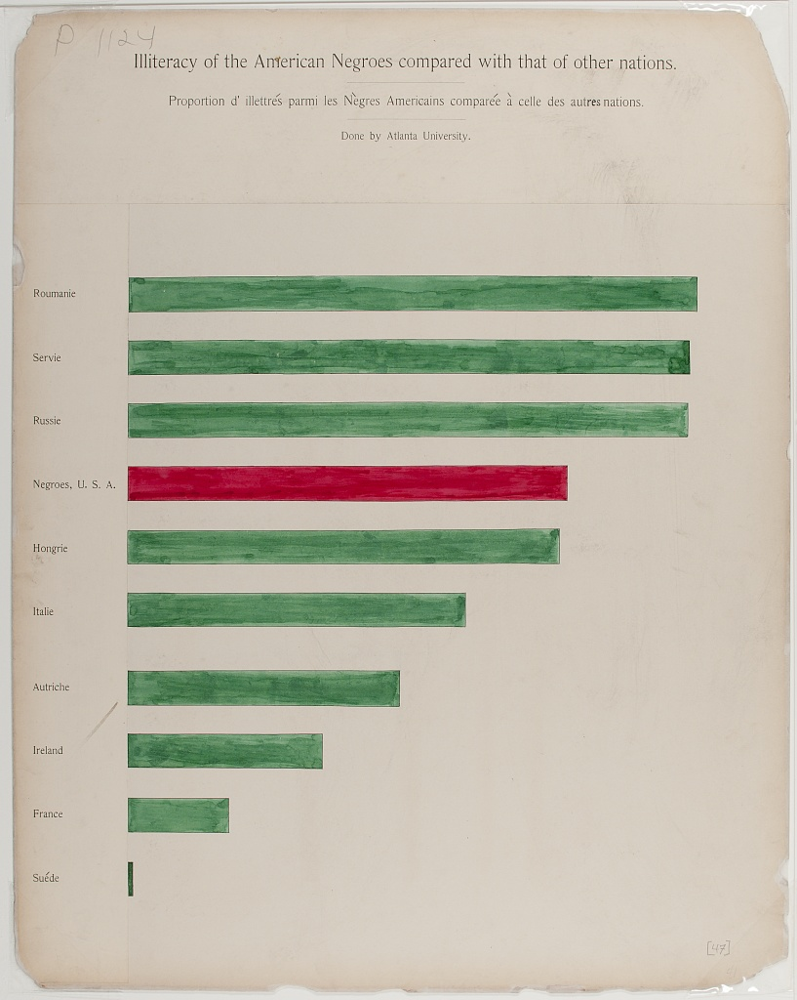
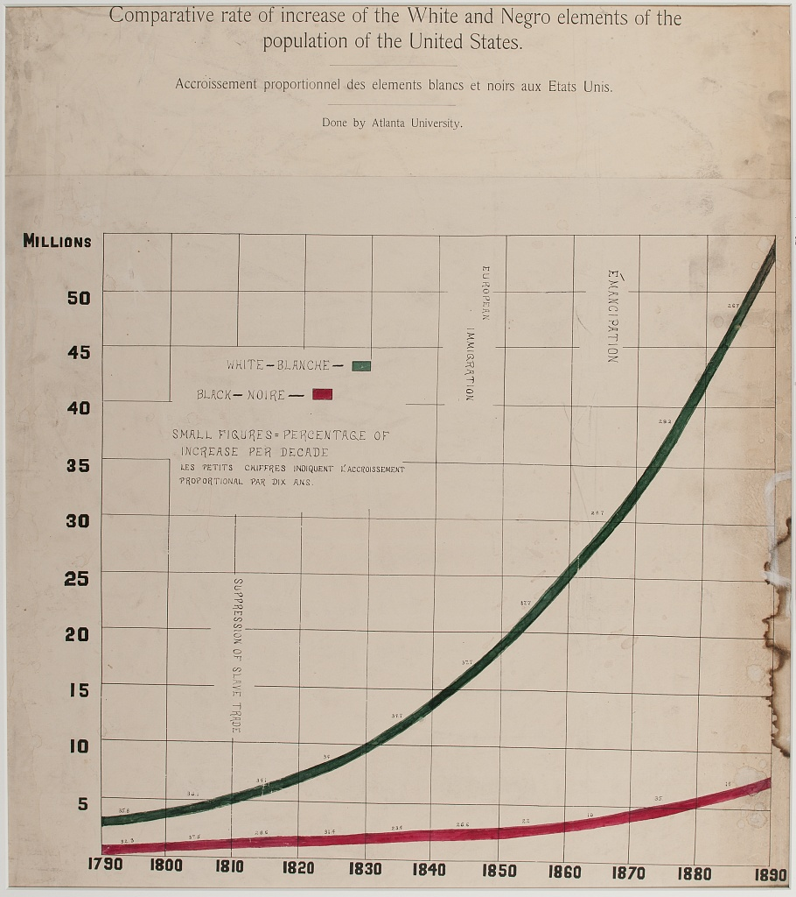
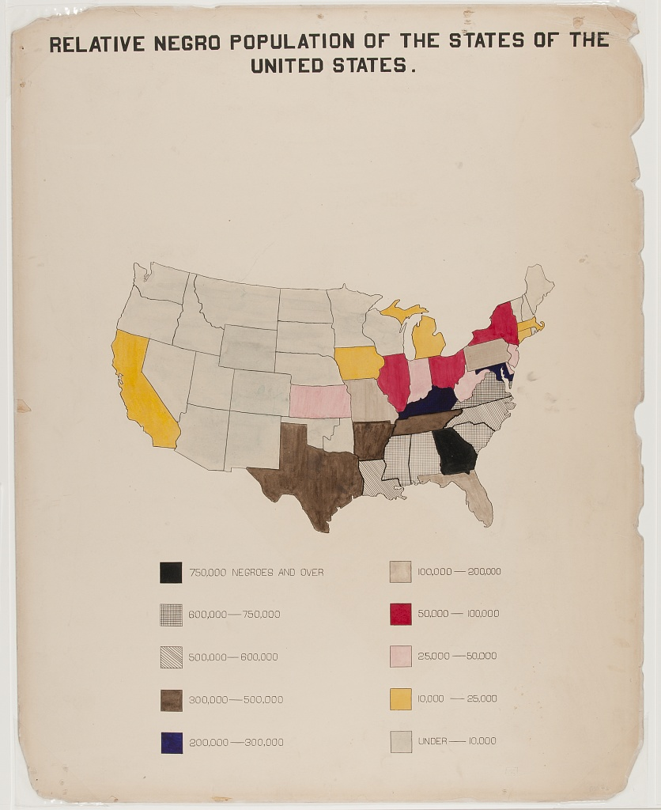
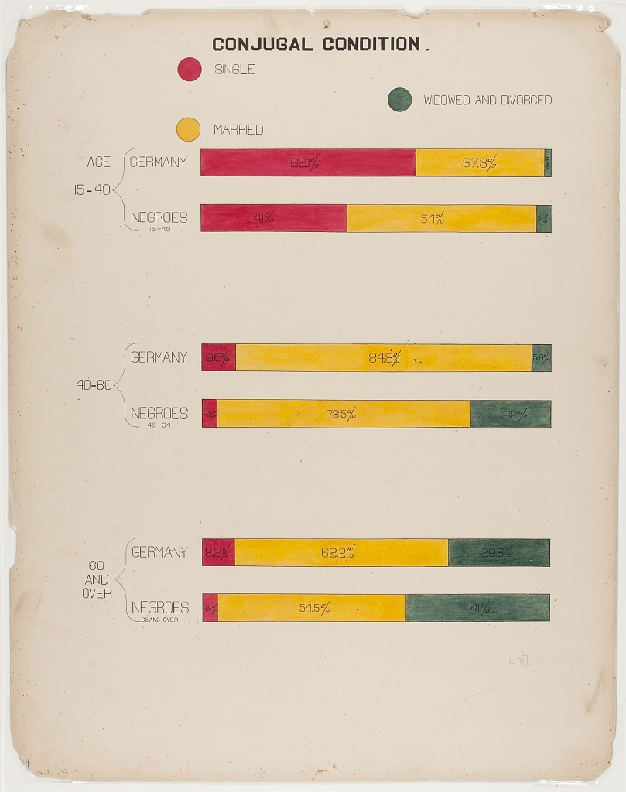
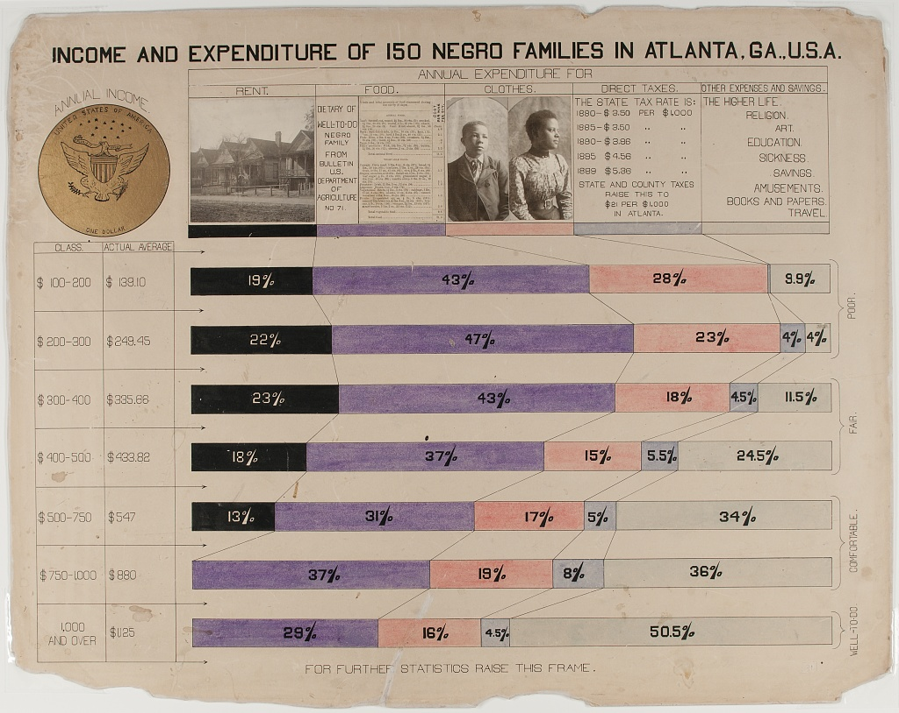
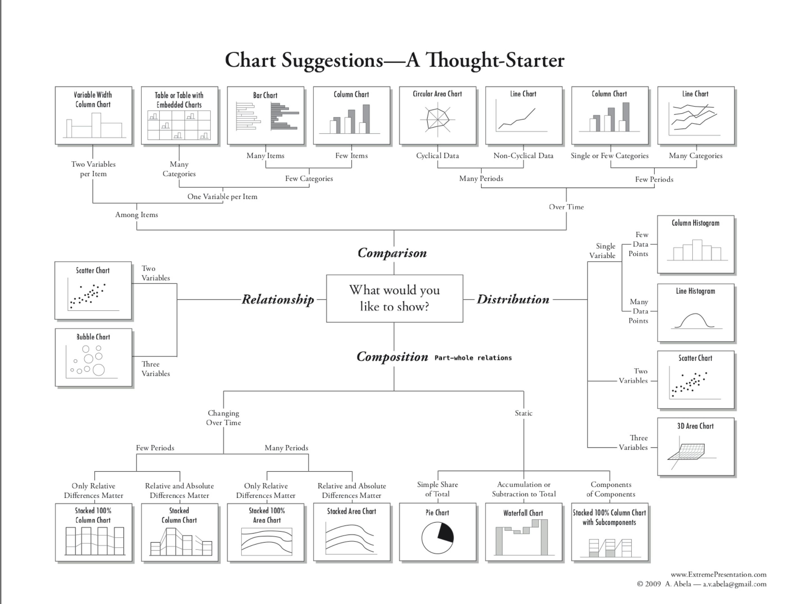
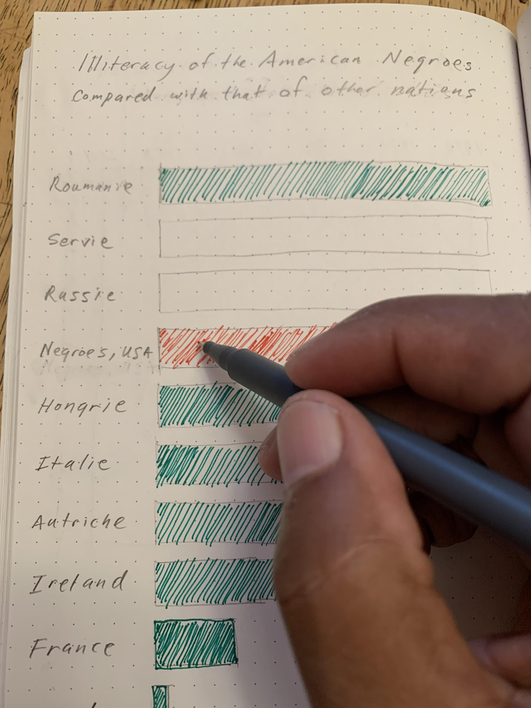

:::: instructor

We find that this lesson site is pedagogically very effective when used as 
lecture notes and learning activity instructions. We do not recommend lecturing 
with a screen share of the lesson site or projection of the lesson site.
This combination of text, activity prompts, and verbal narration tends to exceed effective cognitive loads for learners.

But this lesson works best with slides that include 1) photos from the production of the Du Bois charts and the Paris World Expo, and 2) examples of Du Bois charts. We provide these images within the lesson site so that you can open them in separate browser tabs for display while you lecture. 

Alternatively, you can copy and modify [Google Slides deck](https://docs.google.com/presentation/d/1D9f5neRZ0fPNMgI4RHjipco_vGyvu26wZqU-LI34RgQ/edit?slide=id.g3bce95e4b79_2_28#slide=id.g3bce95e4b79_2_28) with all of the images for this episode.

Subsequent episodes will have links to separate Google Slide Decks with their 
images.


::::::::::::

:::::::::::::::::::::::::::::::::::::: questions 

- What are the major STEM chart types, all used by Du Bois?
- What universal design practices can make charts more accessible and effective?
- How did Du Bois use these practices effectively in one of his charts?

::::::::::::::::::::::::::::::::::::::::::::::::

::::::::::::::::::::::::::::::::::::: objectives
- Understand which chart types are best suited for data with different levels of measurement (nominal, ordinal, continous).
- Read and interpret the analysis in one of the Du Bois charts.
- Identify best practices for chart accessibity and impact in a Du Bois chart.
- Draw a STEM chart by hand using statistics that describe real data.


::::::::::::::::::::::::::::::::::::::::::::::::

## Video overview

<iframe width="560" height="315" src="https://www.youtube.com/embed/z77Icn64w5c?si=KzlYNPA-kaA8-qjO" title="YouTube video player" frameborder="0" allow="accelerometer; autoplay; clipboard-write; encrypted-media; gyroscope; picture-in-picture; web-share" referrerpolicy="strict-origin-when-cross-origin" allowfullscreen></iframe>

## Chart Types

- We use different types of graphs based on the types of data and relationships we are analyzing.
- Du Bois used variants of most of the major graph types that are still used today: (pie, bar, cartesian line charts, and statistical maps).

### Fan Chart and Bar Chart
<figure>
<div>


</div>
</figure>

### Cartesian Line Chart and Statistical Map
<figure>
<div>


</div>
</figure>


### More complex applications
- You can also explore more complex applications of these chart types using the [Du Bois Resources repository for this lesson:] 
 (https://github.com/HigherEdData/Du-Bois-STEM)
- The types include the fanciful Du Bois spiral, stacked bar charts, and integrated photographs.

<figure>
<div>



</div>
</figure>

## Chart Types and Types of Data

### Types of Data

We use different chart types for different types of data. Two key types of data are sometimes referred to as levels of measurement:

- **Categorical** (also called nominal. Examples: demographic group, species).
- **Continuous** (also called interval ratio. Examples: distance, duration, quantity).

### Types of Statistics

Charts commonly use visual elements to represent statistics computed from either categorical or continuous data, including:

- Proportions (from categorical data)
- Frequencies (from categorical data or a quantile of continuous data)
- Central tendencies like means, medians (from continuous measures)

### Numbers of variables

- Different variants of charts are also used to represent data for multiple related variables.
- But even pie charts, which represent a distribution across categories of a single categorical variable, can be used to represent data for multiple variables by splitting the chart into separate panels for units in different subcategories.

### Pie Charts

- Pie graphs illustrate the
proportion (or percentage) of units observed in different exclusive categories (like occupations) within a population, with 
all the percentages adding up to 100%.
- This analyzes a distribution across one categorical variable.
- Du Bois' fanchart variant of a pie chart below creatively compares 
distributions of people across one categorical variable (occupations)
within categories for another variable (race).

{width=500px}


### Chart Types: Bar Charts

- Bar graphs compare statistics for one variable
across bar categories for another variable.
- As in the graph below, a bar graph can represent **statistics for a categorical variable** like frequencies or percentages of literacy **within bar categories** of the other variable (in this case nation). This bar graph thus visualizes elements of a **contingency table.**
- A bar graph can also represent **statistics of continous variables** like means **within bar categories** of another variable.
- **Cluster bar charts** can be used for comparisons across additional categorial variables.


{width=500px}


### Chart Types: Cartesian Line Charts

- These graphs allow us to represent relationships between
two variables with continuous measures.
- The line graph below represents the frequency of the total population within the white and Black categories of a race variable on the Y-axis over year as a continous variable on the X-axis.
- Line graphs can also use multiple lines for different categories of a variable (like race) to represent the relationship of a 2nd continuous variable (like average income) on the Y-axis between those categories *and* across variation in a third continous variable on the X-axis (like year).
- Scatter plots use a similar framework, plotting a point for each observed unit according to its continous observed values for one variable on the Y-axis and another variable on the X-axis. Regression or fitted lines
then represent the relationship between these two variables.
- Time series line graphs, with
time on the x-axis, are the
most common type of cartesian line
graph.

{width=500px}


### Chart Types: Statistical Maps

- Statistical maps graph
geo-spatial distributions of
continuous interval-ratio
variables (like the Black
population of the U.S.) across categorical geographic units
like states.
- In our mapping activity, we review methods for choosing
choropleth (color and shading) categories that represent
different ranges of continous measures (like Black population size)
between geographic units.

{width=500px}


### Other chart variants
This diagram offers a tool for choosing between additional variants of (chart types for different types of data and analyses:)[https://github.com/HigherEdData/Du-Bois-STEM]




## Design Aesthetics and Accessibility

While Du Bois sought to make his visualizations accessible to broad
audiences, advances in universal design practices do even more to
make visualizations accessible to people with diverse visual,
cognitive, auditory, or motor strengths and needs. Practices include:

* Keeping visuals as simple as possible, presenting only
information necessary for analysis.

* Color-blind friendly use of color and contrast, avoiding
over-reliance on color

* Alternative text (alt text) that screen readers can use to provide
an audio description of images.

* Descriptive titles and labels
* Offering both visual and non-visual formats

* Including narrative text with context and summaries

## Literacy Bar Chart: a worked example

{width=500px}

::::::::::::::::::::::::::::::::::::: challenge 


### Challenge 1: Reading the Chart

* What type of graph is this?
 * What variables are plotted on the chart?
 * Are the variables categorical, ordinal, or interval / ratio?
 * What statistics are plotted?
 * Which category is highlighted?

::::::::::::::::::::::::::::::::::::: hint

How does Black illiteracy (the red bar) compare with other countries

::::::::::::::::::::::::::::::::::::::::::::::::

::::::::::::::::::::::::::::::::::::: solution

### Answers
 * What variables are plotted: Country, Illiteracy rate
 * Variable types: Country is categorical. Illiteracy rate is continous, though it is derived from person-level categorical measures (literate or not literate)
 * Statistics plotted: Proportions (as percentages) of llitercy rate
 * The Black illiteracy rate is highlighted.
 
::::::::::::::::::::::::::::::::::::::::::::::::

::::::::::::::::::::::::::::::::::::::::::::::::

::::::::::::::::::::::::::::::::::::: discussion

### Disucssion

* How does Black illiteracy
compare to literacy in other
countries on the chart?

* What is similar about the
countries with higher illiteracy
than Black illiteracy in the US?

::::::::::::::::::::::::::::::::::::::::::::::::


## Design Aesthetics and Accessibility

:::::::::::::::::::::::::::::::::::::: questions 

What makes the bar chart above  graph easy or
difficult to understand?

How is the graph aesthetically
appealing? How could could it be
more appealing?

How does this graph take its
audience into consideration?

What tools would you need to create
this graph by hand?

::::::::::::::::::::::::::::::::::::::::::::::::


::::::::::::::::::::::::::::::::::::: discussion

This visual, a conventional bar graph,
uses spot color to highlight the data
for Black Americans compared to
other countries, showing the
illiteracy rate to be at the midpoint
compared to other nations.

The chart portion is a large
percentage of the canvas, simply
showing the message.

Note the bilingual labels and titles (a
nod to the venue and audience).

::::::::::::::::::::::::::::::::::::::::::::::::

## Context and Data Story

Du Bois presented his graph for illiteracy among Black Americans and other
nations (left), together with the graph of Black illiteracy in Georgia from 1865
to 1900. What data story do these 2 graphs tell together?

<figure>
<div>


</div>
</figure>

# Example: Re-Create with Modern Data and Accessible Design




:::::::::::::::::::::::::::::::::::: discussion

Activity: Hand draw a recreation of
Du Bois’ graph using the data below
on college attainment today.

Building on the graph to the left,
what accessible design
improvements can you make?

Data: 

```
Country		College

Russia		60
Ireland		54
Sweden		49
France		42
Black U.S. 
Residents	36
Austria		36
Hungary		29
Serbia		28
Romania		20
Italy		20
```

::::::::::::::::::::::::::::::::::::::::::::::::


::::::::::::::::::::::::::::::::::::: keypoints 

- Even simple chart types can convey interesting meaning. Color man be used to emphasize points

::::::::::::::::::::::::::::::::::::::::::::::::

[r-markdown]: https://rmarkdown.rstudio.com/
