:::: instructor

We find that this lesson site is pedagogically very effective when used as 
lecture notes and learning activity instructions. We do not recommend lecturing 
with a screen share of the lesson site or projection of the lesson site.
This combination of text, activity prompts, and verbal narration tends to exceed effective
cognitive loads for learners.

But this lesson works best with slides that include 1) photos from the production
of the Du Bois charts and the Paris World Expo, and 2) examples of Du Bois charts.
We provide these images within the lesson site so that you can open them in separate
browser tabs for display while you lecture. 

Subsequent episodes will have links to separate Google Slide Decks with their 
images.

::::::::::::

### Learning from the Innovations of W.E.B. Du Bois

This content is also available in [Google Slides](https://docs.google.com/presentation/d/1AeePkTUoLgjxTNNlPH3IoIfZ4z3fH_1JNuowaa914jU/edit?usp=sharing) that can be copied and edited.

:::::::::::::::::::::::::::::::::::::: questions 

- How can data visualization and creativity help answer important scientific questions?
- Why did data visualization become predominant in the social sciences earlier than for physical and natural sciences?
- How did Du Bubois use data visualization to challenge false biological theories of racial inequality?
- How did team science help Du Bois' team to create impactful visualizations for the 1900 Paris exposition?

::::::::::::::::::::::::::::::::::::::::::::::::

::::::::::::::::::::::::::::::::::::: objectives

- Understand how data visualization promotes scientific discovery.

- Explain early innovations in data visualization by W.E.B. Du Bois and other Black and women scientists in his Lab.  

- Analyze the appropriate types of data visualization charts for different kinds of measurements, relationships, and scientific findings.  

- Engage in a creative process of data visualization in the style of W.E.B. Du Bois, by applying techniques by hand and with statistical software.

::::::::::::::::::::::::::::::::::::::::::::::::

# Visualizations Help Formulate New Hypotheses

*If I can’t picture it, I can’t understand it.* – Albert Einstein

The first thing scientists want to do is understand an issue correctly. Visualizing data with charts, in contrast to tables, helps scientists understand data because:

1) It is often difficult for people to view a large dataset in a table comprehensively.

2) People are able to identify concrete patterns and associations more easily in data visualizations. 

# Why Communicate Through Visualizations?

Another thing scientists need to do is to communicate their findings effectively. Visualizing data is important to scientific communication because:

Scientific discovery requires communicating our ideas and evidence to other scientists who can challenge or build on our findings.

Charts, graphs, and other visuals can clarify associations between two or more things.  

For example, health researcher Florence Nightingale used data visualization early on to communicate scientific findings in ways that the public and policymakers could use to save lives.

# Why the History of Data Visualization Matters Now

The social scientist W.E.B. Du Bois 
provided one of the *earliest models* for effectively developing data visualizations, demonstrating how science matters for the most critical material and moral issues of the day

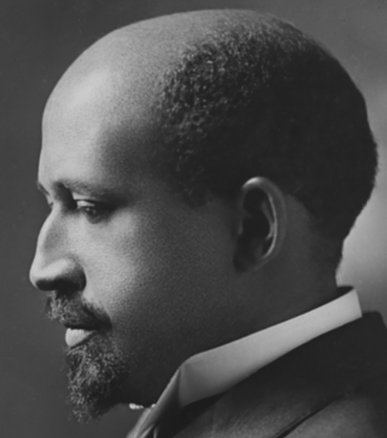

# What Motivated DuBois?

Du Bois cared about the truth. He lived during a time when biological explanations were popular among scientist to explain racial inequality. 

Du Bois asked, instead, how discriminatory policies and the material consequences of slavery created unequal outcomes in wealth, literacy, and wellbeing.  Du Bois and the Atlanta University Laboratory developed new questions for the US Census and conducted scientific surveys of the population. His Lab included investigators of different racial/ethnic backgrounds and it included women, which was not the norm at that time.

<figure>

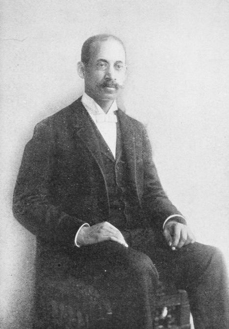

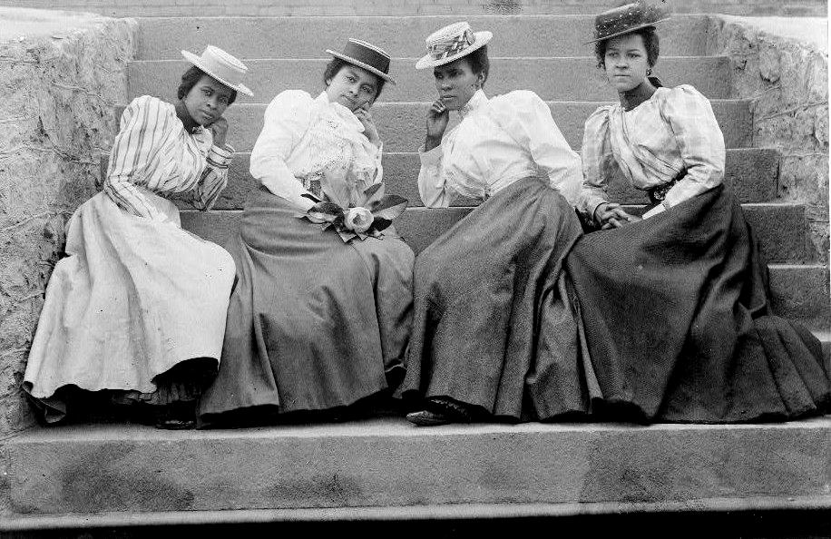

</figure>

The figures show [Thomas Calloway](https://en.wikipedia.org/wiki/Thomas_J._Calloway), the oranizer of the “Exhibition of the American Negro”, [Du Bois during the [Paris Exposition in 1900](https://en.wikipedia.org/wiki/Exposition_Universelle_%281900%29), and [Atlanta University Students](https://umbrasearch.org/catalog/026e2cfa26b78a7312d66757e7606dc01c7236bd), circa 1900.

# Data Visualization as a Scientific Concern for the Du Bois Lab

* The Du Bois Lab found evidence to refute theories that falsely claimed inherent biological differences between races. 

* The Du Bois Lab used creative visualizations to help their team work with new data, make new connections, and to ask critical questions about the objects of study

* The Du Bois Lab communicated their evidence and arguments using data visualization that could be understood by wide audiences. 

# Communicating Science to the Public: The 1900 Paris Exposition

The 1900 World Fair in Paris provided a venue for Du Bois to challenge erroneous theories about racial difference and inequality. The exposition showcased the latest scientific discoveries and inventions to 50 million attendees from around the world.

<figure>

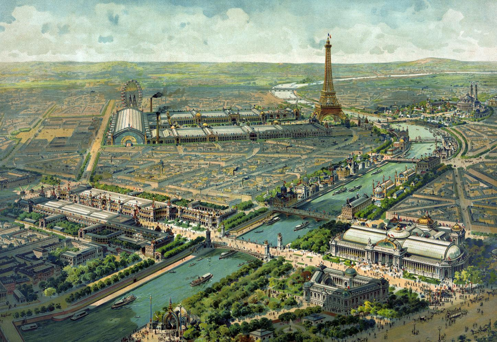
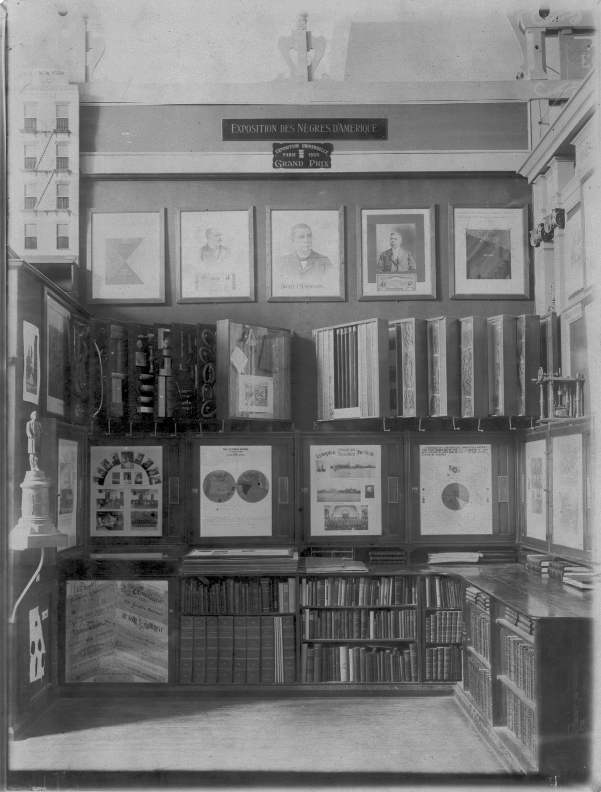

</figure>

# Motivation: What could a scientist do?

:::::::::::::::::::::::::::::::::::::: questions 

What could Du Bois do as a scientist to challenge widely believed but false theories of racial inequality?

How could Du Bois best present his ideas and evidence at the Paris Exposition with the technologies available to him?

What could you do today as a scientist to challenge theories about how a phenomenon operates that might be wrong?

In your potential career, how might you visualize data? 

::::::::::::::::::::::::::::::::::::::::::::::::

# Turning Data into Art

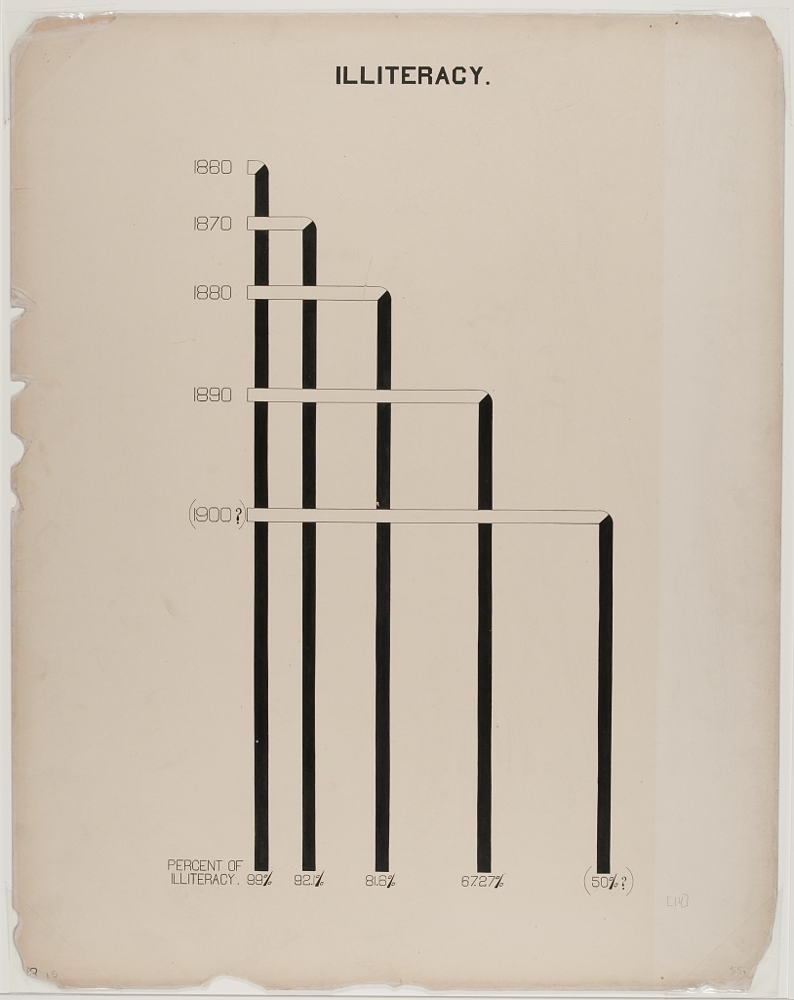

The Du Bois Lab creatively used charts to depict data about racial inequality.

This helped them show, for example, that when the US government ended bans on Black literacy in the South after Emancipation, illiteracy declined sharply. 

The Lab even found that Black illiteracy had declined to lower levels than found in some parts of Europe where conditions of serfdom kept illiteracy high into the late 1800s.

# Combining Different Art Forms

The Du Bois Lab used a range of charts that combined different kinds of data with visual art, including maps, photographs, and drawings, to detail change over time.

# Picture This: Getting Creative With Data

# Praised and Preserved

What we remember and praise, we preserve. These charts have been praised for their ability to draw in viewers. The charts are also preserved in the [*Library of Congress*](https://www.loc.gov/collections/african-american-photographs-1900-paris-exposition/?c=200&sp=3&st=grid). Fisk University also houses an archive of Du Bois data visualizations.   

<figure>

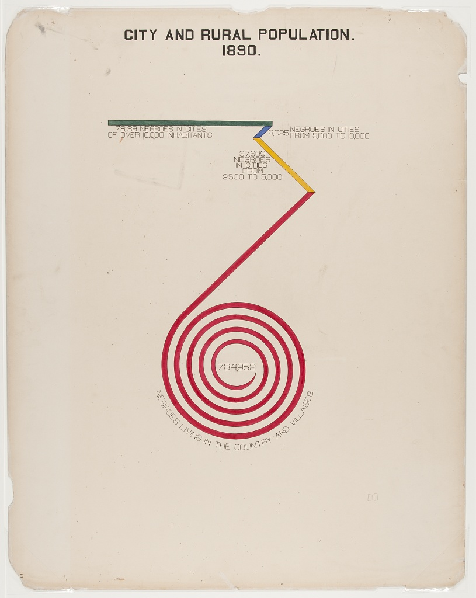

</figure>

# Recap (Overall Learning Objectives)

1) The central place of data visualizations in the process of scientific discovery and in communicating those discoveries. The history of the DuBois Lab exemplifies this.

2) It matters which type of chart or graph is used to depict a relationship, a cause, or a process. Some work better than others.

3) Science requires creativity for discovery. Data visualizations help communicate relevant scientific findings to audiences effectively. 

# Context

Now let's begin with the context. The Context section provides background on the conception, motivation, and messaging of the data visuals. 

Note the two images below: The first if Du Bois in Paris, and the second is the venue for the "Exposition of the American Negro", part of the Paris Expostion of 1900.

<figure>

</figure>

 Du Bois was trained at Fisk University, a HBCU in Nashville, TN. 

He was first Black American to earn a PhD from Harvard University, and studied internationally as well. As we will demonstrate, Du Bois was a canonical US social scientist who notably used innovative data visualizations to tell theoretically astute data stories about Black Americans and Black empowerment for broad audiences, we believe setting the foundation for what is now recognized as visualization and storytelling in STEM and other disciplines. Du Bois was also among the first professors in the nation to train students in sociological theory and empirical methodologies, including large scale quantitative surveys wherein they collected, analyzed, and visualized data.

Also discussed is the venue where the visuals were first shown, the Exhibition of the American Negro, within the 1900 Paris Exposition. The Paris Exposition was a world fair that was supposed to showcase achievements of the last century and move into developments for the next century” To better understand the times when the visuals were created, influential events leading to the Exposition are discussed.

::::::::::::::::::::::::::::::::::::: challenge

### Exercise 1
Why do you think Du Bois created a series of graphs and data visualizations of Black life for the exposition?

::::::::::::::::::::::::::::::::::::::::::::::::

::::::::::::::::::::::::::::::::::::: hint

Why visualizations instead of a written report?

::::::::::::::::::::::::::::::::::::::::::::::::

::::::::::::::::::::::::::::::::::::: solution

### Solution 1
Du Bois used rigorous yet accessible methods to challenge subsequently discredited claims associated with scientific racism that devalued and assumed Black communities as inferior. The visualizations helped show some of the systemic barriers impeding the progress for black Americans as compared to a deficit approach that would suggest black people were somehow innately less capable. This is a paradigm shift in showing how social science can work together with other STEM fields to produce the most accurate science and impressive visualizations. 

::::::::::::::::::::::::::::::::::::::::::::::::

::::::::::::::::::::::::::::::::::::: discussion

### Discussion

What effect did the venue have on the design of the visuals?

::::::::::::::::::::::::::::::::::::::::::::::::

::::::::::::::::::::::::::::::::::::: keypoints 

- This is a place for writing key points that students have learned in this episode.

::::::::::::::::::::::::::::::::::::::::::::::::

# Context: Five Years Before Paris

<figure>

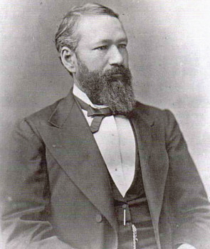
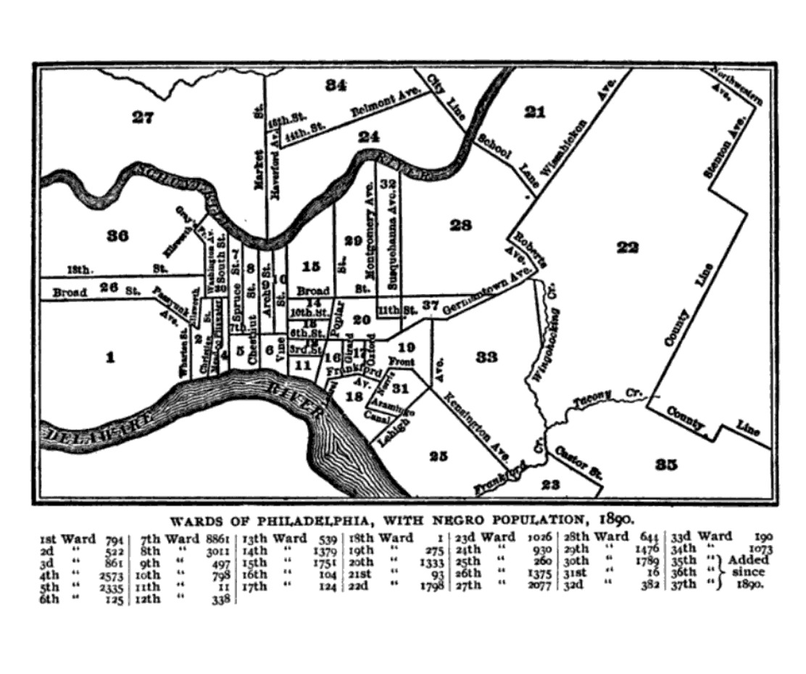
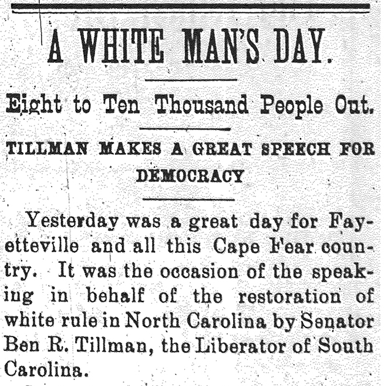
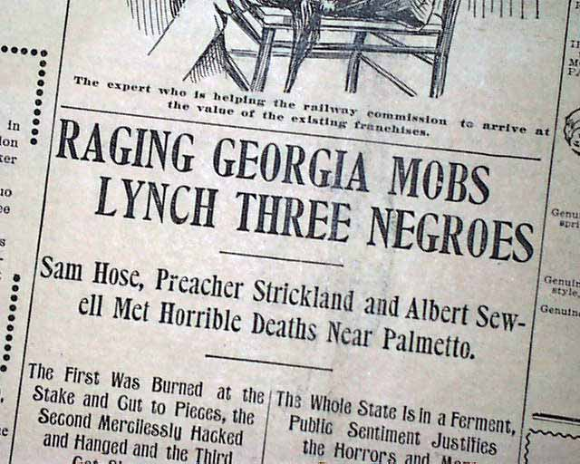

</figure>

To provide context for the events that led up to the Paris exposition
in 1900, here are several events that led to the event.

During the summer of *1895*, in a Brooklyn park, there was a cotton
 plantation complete with five hundred Black workers reenacting
 slavery for the "pleasure" of the crowds. The show was called "Black
 America, 1985".

In *1896* the Supreme Court of the US handed down the Plessey vs.
Ferguson ruling that upheld the constitutionality of racial
segregation under the "separate but equal" doctrine.

*In 1897*, Du Bois embarked upon a study called "The Philadelphia
 Negro" he described it as "This inquiry extended over fifteen
 months, and sought to ascertain something of the geographical
 distribution of this race, their organizations, and above all their
 relation to their million white fellow-citizens"

*In 1898* the duly elected people in Wilmington NC was violently
 overthrown by whites. The coup occurred after the state's white
 Southern Democrats conspired and led a mob of 2,000 white men to
 overthrow the legitimately-elected local Fusionist government. They
 expelled opposition black and white political leaders from the city,
 destroyed the property and businesses of black citizens built up
 since the Civil War, including the only black newspaper in the city,
 and killed an estimated 60 to more than 300 people

*1899:* Georgia's toll of 458 lynch victims was exceeded only by
 Mississippi's toll of 538. During the 1880s and 1890s, instances of
 lethal mob violence increased steadily, peaking in 1899 when
 twenty-seven Georgians fell victim to lynch mobs. Between 1890 and
 1900 Georgia averaged more than one mob killing per month.

# 1900 Paris Exposition

The Exposition Universelle of 1900, meant to to celebrate the achievements of the past century and to accelerate development into the next century, was the venue for Du Bois to tell the story of Black Americans advancement and achievements on an international stage.

<figure>

</figure>

# Background

# Why Visualize Data?

# The visuals

<figure>

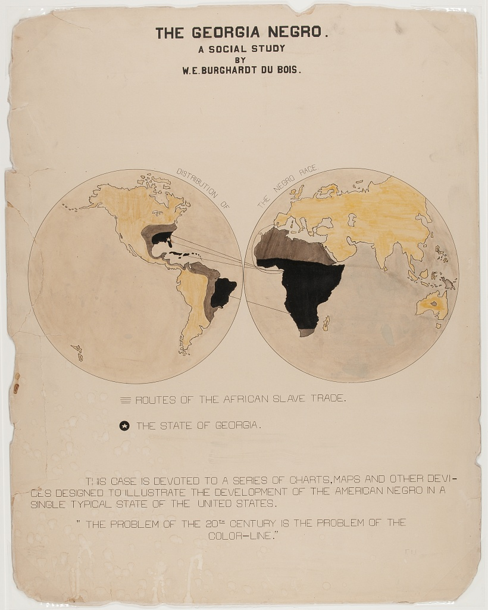

</figure>

::::::::::::::::::::::::::::::::::::: discussion

Why do you think Du Bois created a series of graphs and data visualizations of Black life for the exposition?

Why visualizations instead of a written report?

What effect did the venue have on the design of the visuals?

::::::::::::::::::::::::::::::::::::::::::::::::

# References

1. (Paris Exposition of 1900 (Exposition Universelle))
[https://en.wikipedia.org/wiki/Exposition_Universelle_(1900)]

2. (Black America, 1895)
[https://publicdomainreview.org/essay/black-america-1895]

3. (Plessy v. Ferguson)
[https://www.britannica.com/event/Plessy-v-Ferguson-1896]

4. (The Philadelphia Negro)
[https://www.google.com/books/edition/_/sqwJAAAAIAAJ]

5. (Wilmington Insurrection of 1898)
[https://en.wikipedia.org/wiki/Wilmington_insurrection_of_1898]

6. (The Lynching of Sam Hose)
[https://en.wikipedia.org/wiki/Lynching_of_Sam_Hose]

[r-markdown]: https://rmarkdown.rstudio.com/
