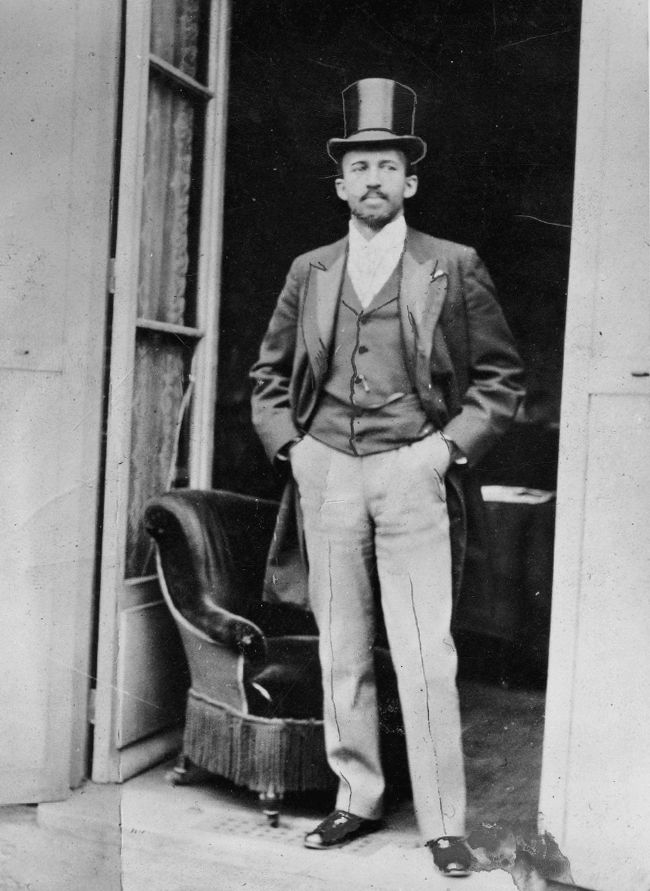
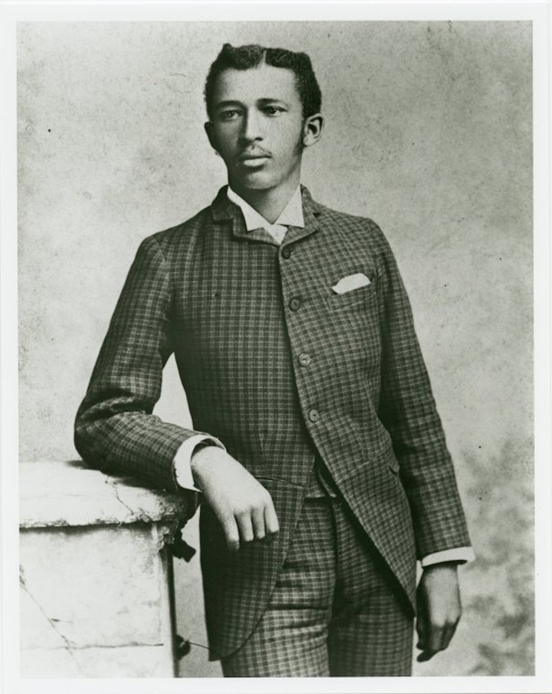
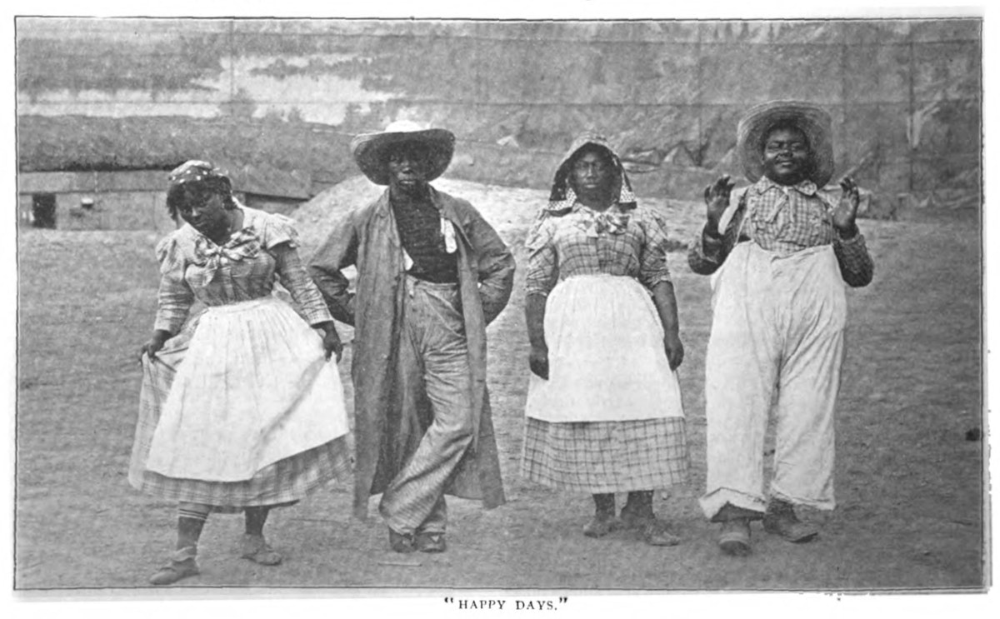
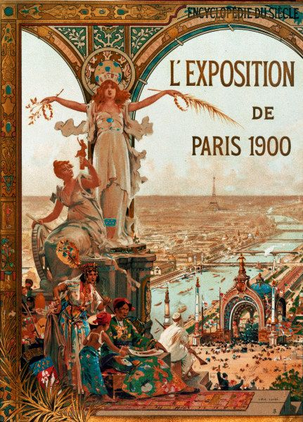

:::: instructor

We find that this lesson site is pedagogically very effective when used as 
lecture notes and learning activity instructions. We do not recommend lecturing 
with a screen share of the lesson site or projection of the lesson site.
This combination of text, activity prompts, and verbal narration tends to exceed effective
cognitive loads for learners.

But this lesson works best with slides that include 1) photos from the production
of the Du Bois charts and the Paris World Expo, and 2) examples of Du Bois charts.
We provide these images within the lesson site so that you can open them in separate
browser tabs for display while you lecture. 

Alternatively, you can copy and modify [this Google Slides deck](https://docs.google.com/presentation/d/1mVh4c4bYjM5DDp6ix33fo1ZYS8NE15QdKYOUB1lx7H4/edit?slide=id.g2f60d06f563_0_22#slide=id.g2f60d06f563_0_22) with all of the images for this episode.

Subsequent episodes will have links to separate Google Slide Decks with their 
images.

::::::::::::

:::::::::::::::::::::::::::::::::::::: questions 

- How can data visualization and creativity help answer important scientific questions?
- Why did data visualization become predominant in the social sciences earlier than for physical and natural sciences?
- How did Du Bubois use data visualization to challenge false biological theories of racial inequality?
- How did team science help Du Bois' team to create impactful visualizations for the 1900 Paris exposition?

::::::::::::::::::::::::::::::::::::::::::::::::

::::::::::::::::::::::::::::::::::::: objectives

- Explain why data visualization and creativity are vital tools in scientific research.
- Comprehend why data visualization historically originated in the social sciences, including Du Bois' analyses that challenged false biological theories of racial inequality. 
- Understand how Du Bois used visualizations to accessibly communicate findings to a broad audience.
- Undrstand the benefits of a "team science" approach similar to that used by Du Bois. (too much)

::::::::::::::::::::::::::::::::::::::::::::::::

# Context

<!--
<figure caption="Context">

	
	

</caption>
-->

Now let's begin with the context. The Context section provides background on the conception, motivation, and messaging of the data visuals. 

This slide has two images; the 1st image is of WEB Du Bois and the second is of his Paris exhibit. Du Bois was trained at Fisk University, a HBCU in Nashville, TN. 

He was first Black American to earn a PhD from Harvard University, and studied internationally as well. As we will demonstrate, Du Bois was a canonical US social scientist who notably used innovative data visualizations to tell theoretically astute data stories about Black Americans and Black empowerment for broad audiences, we believe setting the foundation for what is now recognized as visualization and storytelling in STEM and other disciplines. Du Bois was also among the first professors in the nation to train students in sociological theory and empirical methodologies, including large scale quantitative surveys wherein they collected, analyzed, and visualized data.

Also discussed is the venue where the visuals were first shown, the Exhibition of the American Negro, within the 1900 Paris Exposition. The Paris Exposition was a world fair that was supposed to showcase achievements of the last century and move into developments for the next century” To better understand the times when the visuals were created, influential events leading to the Exposition are discussed.

::::::::::::::::::::::::::::::::::::: challenge

### Exercise 1
Why do you think Du Bois created a series of graphs and data visualizations of Black life for the exposition?

::::::::::::::::::::::::::::::::::::::::::::::::

::::::::::::::::::::::::::::::::::::: hint

Why visualizations instead of a written report?

::::::::::::::::::::::::::::::::::::::::::::::::

::::::::::::::::::::::::::::::::::::: solution

### Solution 1
Du Bois used rigorous yet accessible methods to challenge subsequently discredited claims associated with scientific racism that devalued and assumed Black communities as inferior. The visualizations helped show some of the systemic barriers impeding the progress for black Americans as compared to a deficit approach that would suggest black people were somehow innately less capable. This is a paradigm shift in showing how social science can work together with other STEM fields to produce the most accurate science and impressive visualizations. 

::::::::::::::::::::::::::::::::::::::::::::::::

::::::::::::::::::::::::::::::::::::: discussion

### Discussion

What effect did the venue have on the design of the visuals?

::::::::::::::::::::::::::::::::::::::::::::::::

::::::::::::::::::::::::::::::::::::: keypoints 

- This is a place for writing key points that students have learned in this episode.

::::::::::::::::::::::::::::::::::::::::::::::::

# Context: Five Years Before Paris

To provide context for the events that led up to the Paris exposition
in 1900, here are several events that led to the event.

*During the summer of 1895*, in a Brooklyn park, there was a cotton
 plantation complete with five hundred Black workers reenacting
 slavery for the "pleasure" of the crowds. The show was called "Black
 America, 1985".

In *1896* the Supreme Court of the US handed down the Plessey vs.
Ferguson ruling that upheld the constitutionality of racial
segregation under the "separate but equal" doctrine.

*In 1897*, Du Bois embarked upon a study called "The Philadelphia
 Negro" he described it as "This inquiry extended over fifteen
 months, and sought to ascertain something of the geographical
 distribution of this race, their organizations, and above all their
 relation to their million white fellow-citizens"

*In 1898* the duly elected people in Wilmington NC was violently
 overthrown by whites. The coup occurred after the state's white
 Southern Democrats conspired and led a mob of 2,000 white men to
 overthrow the legitimately-elected local Fusionist government. They
 expelled opposition black and white political leaders from the city,
 destroyed the property and businesses of black citizens built up
 since the Civil War, including the only black newspaper in the city,
 and killed an estimated 60 to more than 300 people

*1899:* Georgia's toll of 458 lynch victims was exceeded only by
 Mississippi's toll of 538. During the 1880s and 1890s, instances of
 lethal mob violence increased steadily, peaking in 1899 when
 twenty-seven Georgians fell victim to lynch mobs. Between 1890 and
 1900 Georgia averaged more than one mob killing per month.

<!--
<figure>
	

		
		
		
		
		
	

</figure>
-->

# 1900 Paris Exposition

The Exposition Universelle of 1900, meant to to celebrate the achievements of the past century and to accelerate development into the next century, was the venue for Du Bois to tell the story of Black Americans advancement and achievements on an international stage.

<figure>
	

		
		
		
	

</figure>

# Background

# Why Visualize Data?

# The visuals

<figure>
	

		<image src="original-plate-01.jpg" width="40%"/>
		<image src="expo0.jpg" width="40%"/>
	

</figure>

::::::::::::::::::::::::::::::::::::: discussion

Why do you think Du Bois created a series of graphs and data visualizations of Black life for the exposition?

Why visualizations instead of a written report?

What effect did the venue have on the design of the visuals?

::::::::::::::::::::::::::::::::::::::::::::::::

# References

1. (Paris Exposition of 1900 (Exposition Universelle))
[https://en.wikipedia.org/wiki/Exposition_Universelle_(1900)]

2. (Black America, 1895)
[https://publicdomainreview.org/essay/black-america-1895]

3. (Plessy v. Ferguson)
[https://www.britannica.com/event/Plessy-v-Ferguson-1896]

4. (The Philadelphia Negro)
[https://www.google.com/books/edition/_/sqwJAAAAIAAJ]

5. (Wilmington Insurrection of 1898)
[https://en.wikipedia.org/wiki/Wilmington_insurrection_of_1898]

6. (The Lynching of Sam Hose)
[https://en.wikipedia.org/wiki/Lynching_of_Sam_Hose]

[r-markdown]: https://rmarkdown.rstudio.com/
