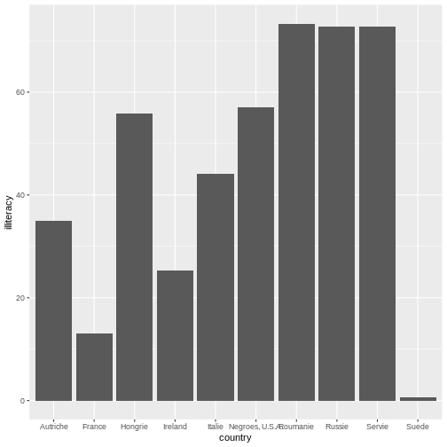
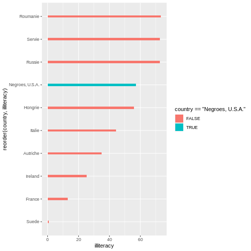
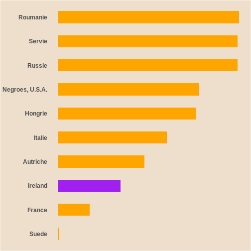
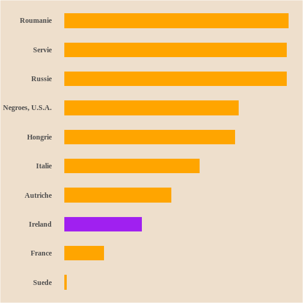

::::::::::::::::::: instructor

### INSTRUCTOR NOTE (`on creativity in this exercise`)

Part of this work will invovle creative attempts at making changes to data visualizations. While the first few exercises are intended to help students become familiar with the basic steps, the final independent exercise is meant to introduce more gaps. If possible, emphasize to students that if they struggle on the final independent exercise it is not about making a perfect graph, but learning how to make changes on their own terms.

::::::::::::::::::::::::::::::

:::::::::::::::::::::::::::::::::::::: questions 

- How can I read tabular data to plot a bar graph in R?
- How can I use ```ggplot``` to organize and format a bar graph in R?
- How can I maintain a reproducible record of my data visualizations?
- How can I use color, text, and dimensions to change the aesthetics of a data visualization?

::::::::::::::::::::::::::::::::::::::::::::::::

::::::::::::::::::::::::::::::::::::: objectives

- Create bar graph variations based on historical tabular data.
- Develop basic R code to create bar graphs.
- Use transparent, legible, and shareable record of how you created your own unique data visualizations.
- Differentiate and use the Du Bois theme in making data visuals.

::::::::::::::::::::::::::::::::::::::::::::::::

## Black Literacy After Emancipation

<div>

</div>
<b>Plate 47</b>

::::::::::::::::: callout

This interactive exercise is inspired by the annual #DuBoisChallenge. The #DuBoisChallenge is a call to scientists, students, and community members to recreate, adapt, and share on social media the data visualzations created by W.E.B. Du Bois and his collaborators in 1900. Before doing the interactive exercise, please read this article about [the Du Bois Challenge](https://nightingaledvs.com/the-dubois-challenge/).

:::::::::::::::::


## Presentation of the historical cross-national literacy data

Du Bois’ created many data portraits to share the story of Black Americans post-emancipation. <b>Plate 47</b> also known as the “Black Literacy After Emancipation” graphic at the top of this page shows mass education as one important strategy for furthering and deepening emancipation for Black Americans and others. In this workbook, you will recreate Du Bois’ visualization of Black illiteracy rates in the US compared to illiteracy rates in other countries using 1900 data.

An important context of Du Bois’s graph of Black illiteracy is that literacy was illegal for enslaved people in the U.S. until emancipation and the Confederacy’s defeat during the Civil War. Illiteracy then declined rapidly as Black Americans sought to empower themselves through education. Du Bois plotted this decline in illiteracy among Black residents in the state of Georgia in the figure below. This graph used decennial US census illiteracy rates for Georgia from 1860 to 1890 that are available here. They likely wrote “50%?” for the 1900 illiteracy rate because the Census did not publish 1900 illiteracy rates (available here) until several months after the Paris Exposition.

<div>

</div>
<b>Plate 14</b>

For this exercise, we’re going to read in data from a website. And we’re going to place the data into a dataframe named d_literacy_country.

d_literacy_country

| column_name | Description |
| --- | --- |
| country | Name of country |
| illiteracy | illiteracy percentage |

## How can I input tabular data to plot a bar graph in R?

The first step for data visualization in R is to read data into an R dataframe. This is like double clicking a file to open it in other computer programs. But with R, we use code.

For this exercise, we’re going to read in data from a website. And we’re going to place the data into a dataframe named d_literacy_country.

There is no record of the exact data used by the Du Bois team for this bar graph. And the Du Bois graph curiously does not include tick marks with a labeled axis scale to show what exact values each bar represents. Why? Perhaps the Du Bois team wanted to emphasize that the bar graph was a rough comparison of illiteracy rates because of varied timing, methods, and national boundaries for measuring illiteracy rates at the time. The length of the “Negroes U.S.A” bar likely represents the national Black illiteracy rate of 57.1% reported by the 1890 US Census (see reported “Russie” (Russia) bar correspond to the national US Black illiteracy rate in the 1890 US Census (see [here](https://www2.census.gov/library/publications/decennial/1900/bulletins/demographic/8-negroes-in-us-part-1.pdf))). So our data derives illiteracy rates for other countries based on the length of each country’s bar relative to “Negroes U.S.A.” bar, presuming the “Negroes U.S.A.” bar represents 57.1%.

The R code to read in this data uses an ```<-``` arrow pointed at the name of the data frame and the ```read.csv()``` function command followed by the web address within parentheses where a csv (comma separated values) data file is located. It looks like this:

```r
d_literacy_country <- read.csv("web_address_with_data/data_file_name.csv")
```
After writing this code, we can write the name of the data frame 

```r
d_literacy_country
```
Typing just the name of the dataframe will list all of the data in the data frame.

::::::::::::::::::::::::::::::::::::: challenge 

## Challenge 1: Reading the data

The web address of the data is: 
https://raw.githubusercontent.com/HigherEdData/Du-Bois-STEM/refs/heads/main/data/d_literacy_country.csv

Update the code below using the web address above.

```
d_literacy_country <- read.csv("web_address_with_data/data_file_name.csv")

d_literacy_country
```

::::::::::::::::: solution


``` r
d_literacy_country <- read.csv("https://raw.githubusercontent.com/HigherEdData/Du-Bois-STEM/refs/heads/main/data/d_literacy_country.csv")

d_literacy_country
```

``` output
           country illiteracy
1         Roumanie    73.3216
2           Servie    72.6727
3           Russie    72.6727
4  Negroes, U.S.A.    57.1000
5          Hongrie    55.8023
6           Italie    44.1227
7         Autriche    35.0386
8          Ireland    25.3057
9           France    12.9773
10           Suede     0.6489
```

:::::::::::::::::

:::::::::::::::::::::::::::::::::::::

## Recreating a Bar Graph

After successfully reading the data above, you should be able to see that the data has two columns. 

Each column is a variable:

* country is a country name for 10 countries and with Black people in the U.S. treated as a country.

* illiteracy contains percent of people in each country who are illiterate.

Before creating a bar graph of the data, we need to read the library ```ggplot2``` and set up a couple parameters. 

```r
library(ggplot2)

options(repr.plot.width=22/3, repr.plot.height=28/3)

source("https://raw.githubusercontent.com/HigherEdData/Du-Bois-STEM/refs/heads/main/theme_dubois.R")
```

The first line of code opens the library of ```ggplot2```. 

Depending on our intention or circumstance, we adapt the size of a graph. The second line of code tells R that we want the width and height of the graph to have the same ratio that Du Bois used, 22 inches wide by 28 inches tall, with each divided by 3 so that it doesn’t display too big.

The third line tells R to use a specific Du Bois style. Examining Du Bois data portraits, we can see a style of format, color, and font text.

The following code creates a simple bar graph using ```ggplot2``` where ```df``` represents the dataframe.

```r
ggplot(df, aes(x=horizon_variable, y=vertical_variable)) + geom_col()
```


``` r
library(ggplot2)

d_literacy_country <- read.csv("https://raw.githubusercontent.com/HigherEdData/Du-Bois-STEM/refs/heads/main/data/d_literacy_country.csv")

ggplot(d_literacy_country, aes( 
  x = country, 
  y = illiteracy)) +
  geom_col()
```



Within this expression, we set the parameters of which variable to be placed across the horizontal (using ```x=variable```) and vertical axes (using ```y=variable```). Typically, bar graphs have categories on the horizontal axis and the values on the vertical axis. However, there are instances where we want to create a horizontal bar graph where categorical values are on the vertical axis and the values are on the horizontal axis. Which bar graph did Du Bois used in <b>Plate 47</b> presented at the top of the page?

::::::::::::::::::::::::::::::::::::: challenge 

## Challenge 2: Horizonal Bar graph

Below is the code to make a traditional bar graph. How can you modify the code in order to make it a horizontal bar graph?

```
ggplot(d_literacy_country, aes( 
  x = country, 
  y = illiteracy)) +
  geom_col()
```

::::::::::::::::: solution

```
ggplot(d_literacy_country, aes(
    x = illiteracy,
    y = country)) +
    geom_col() 
```

:::::::::::::::::

:::::::::::::::::::::::::::::::::::::

Now, our plot is starting to look more like the Du Bois original data creation. In the code from challenge 2, the categories are on x-axis (horizontal) and the rates/numbers are expressed on the y-axis (vertical axis). In the challenge above, we use the ```ggplot``` function to plot a horizontal bar graph of illiteracy rates across the observations (countries and Black Americans).

In the challenge code above, we add a ```ggplot``` function followed by open parentheses ```(``` to tell R that we will plot data from the ```d_literacy_country``` data frame with an “aesthetic mapping" ```aes()``` specification that maps one column of data on the x axis and another column of data on the y axis.

After the close parentheses ```)``` that tells ggplot we want to plot ```d_literacy_country``` data with one variable on the x axis, and another on the y axis, we add a ```+``` notation. When using multi-line code with ```ggplot```, the ```+``` tells R we have more code to read. Specifically here, the ```geom_col()``` function tells ```ggplot``` we want a bar graph based on summary statistics in the dataframe.

## Sorting the Values & Adding Color

In the bar graph you created above, can you tell what order the bars for each country are sorted by?...

It is ordered in alphabetical order. When we observe Du Bois <b>Plate 47</b>, we see Du Bois sorts the bar by illiteracy rate from highest to lowest.

Additionally, Du Bois also graphs illiteracy rate for Black Americans in a different color to make it easier to compare to other countries.

```r
ggplot(d_literacy_country, aes( 
  x = illiteracy, 
  y = reorder(country, illiteracy))) +
    geom_col()
```

Compare the code above with challenge 2, what do you notice? The code above uses the ```reorder``` function to reorganize the country names on the vertical axis based on illiteracy.


``` r
ggplot(d_literacy_country, aes( 
  x = illiteracy, 
  y = reorder(country, illiteracy),
  fill = country == "Ireland"
  )) +
  geom_col()
```


Next, we the ```fill``` function to highlight a specific country: Ireland.

::::::::::::::::::::::::::::::::::::: challenge 

## Challenge 3: Reorder and specify bar color

Observing Plate 47, what name is suppose to stand out? Update the below.

```
ggplot(d_literacy_country, aes( 
  x = illiteracy, 
  y = reorder(country, illiteracy),
  fill = country == "Ireland"
  )) +
  geom_col()
```

::::::::::::::::: solution
 
```
ggplot(d_literacy_country, aes( 
  x = illiteracy, 
  y = reorder(country, illiteracy),
  fill = country == "Negroes, U.S.A."
  )) +
  geom_col()
```

:::::::::::::::::

:::::::::::::::::::::::::::::::::::::

## Adding Du Bois Theme

The style of our current figure does not quite match the original <b>Plate 47</b>. Can you identify 1-2 style characteristics missing?...

A few features missing are: bar colors, background color, and title. Next, we will adapt the code to match the style, specifically: bar width, background color, legend, and other default ```ggplot``` elements.

## Bar width

We can easily edit the bar width by inputting numeric values within the 
```r
geom_col(width = #)
```

Below is the code with width .1.

``` r
ggplot(d_literacy_country, aes( 
  x = illiteracy, 
  y = reorder(country, illiteracy),
  fill = country == "Negroes, U.S.A."
  )) +
  geom_col(width=.1)
```


Below is the code with width 1.

``` r
ggplot(d_literacy_country, aes( 
  x = illiteracy, 
  y = reorder(country, illiteracy),
  fill = country == "Negroes, U.S.A."
  )) +
  geom_col(width=1)
```


Notice the differences?

Additionally, we can add ```theme_dubois()``` within ```geom_col(width = #) + theme_dubois()```. However, make sure to include ```source("https://raw.githubusercontent.com/HigherEdData/Du-Bois-STEM/refs/heads/main/theme_dubois.R")``` prior to using ```theme_dubois()```

::::::::::::::::::::::::::::::::::::: challenge 

## Challenge 4: Bar width and Du Bois theme

Edit the code to include an appropriate width size and ```theme_dubois()```

```
ggplot(d_literacy_country, aes( 
  x = illiteracy, 
  y = reorder(country, illiteracy),
  fill = country == "Negroes, U.S.A."
)) +
  geom_col()
```

::::::::::::::::: solution
 
```
source("https://raw.githubusercontent.com/HigherEdData/Du-Bois-STEM/refs/heads/main/theme_dubois.R")

ggplot(d_literacy_country, aes( 
  x = illiteracy, 
  y = reorder(country, illiteracy),
  fill = country == "Negroes, U.S.A."
)) +
  geom_col(width=.5) +
  theme_dubois()
```

:::::::::::::::::

:::::::::::::::::::::::::::::::::::::

## Changing bar color and font to match Du Bois theme

The function ```scale_fill_manual()``` allows users to adapt the colors of the fill based on values. Remember earlier, the legend printed colors based on TRUE/FALSE of country == "Negroes, U.S.A.". We will build on that previous knowledge to adapt the code:

```r
scale_fill_manual(values = c("TRUE"= "purple", "FALSE" = "orange"))
```


``` r
source("https://raw.githubusercontent.com/HigherEdData/Du-Bois-STEM/refs/heads/main/theme_dubois.R")

ggplot(d_literacy_country, aes( 
  x = illiteracy, 
  y = reorder(country, illiteracy),
  fill = country == "Ireland"
)) +
  geom_col(width=.5) +
  theme_dubois() +
  scale_fill_manual(values = c("TRUE"= "purple", "FALSE" = "orange"))
```


Changing the font to ```theme(text = element_text('serif'))```


``` r
ggplot(d_literacy_country, aes( 
  x = illiteracy, 
  y = reorder(country, illiteracy),
  fill = country == "Ireland"
)) +
  geom_col(width=.5) +
  theme_dubois() +
  scale_fill_manual(values = c("TRUE"= "purple", "FALSE" = "orange"))+
  theme(text = element_text('serif'))
```



::::::::::::::::::::::::::::::::::::: challenge 

## Challenge 5: Changing colors and font style

Below the bar graph uses purple to high Black Americans and the other countries are orange. In the original <b>Plate 47</b>, red is used for Black Americans and darkgreen for the other countries? Update the code.

```
ggplot(d_literacy_country, aes( 
  x = illiteracy, 
  y = reorder(country, illiteracy),
  fill = country == "Negroes, U.S.A."
)) +
  geom_col(width=.5) +
  theme_dubois() +
  scale_fill_manual(values = c("TRUE"= "purple", "FALSE" = "orange"))+
  theme(text = element_text('serif'))
```

::::::::::::::::: solution
 
```
ggplot(d_literacy_country, aes( 
  x = illiteracy, 
  y = reorder(country, illiteracy),
  fill = country == "Negroes, U.S.A."
)) +
  geom_col(width=.5) +
  theme_dubois() +
  scale_fill_manual(values = c("TRUE"= "red", "FALSE" = "darkgreen"))+
  theme(text = element_text('serif'))
```

:::::::::::::::::

:::::::::::::::::::::::::::::::::::::

## Titles

To add titles and subtitles to the graph, we use the ```labs``` function in ```ggplot```. We use the title and subtitle specifications with labs. 

The title text needs to be enclosed in quotation marks. We use the code ```\n``` to tell R to put a "new line" break at different places in the title based on Du Bois' titling.

Fill in the blank with your name in the title code below to show that the graph was recreated by you?

```
labs(
	title="Graph title"
	subtitle="2026"
)
```

::::::::::::::::::::::::::::::::::::: challenge 

## Challenge 6: Adding labels

Based on the <b>Plate 47</b>, update with your name.

```
ggplot(d_literacy_country, aes( 
  x = illiteracy, 
  y = reorder(country, illiteracy),
  fill = country == "Negroes, U.S.A."
)) +
  geom_col(width=.5) +
  theme_dubois() +
  scale_fill_manual(values = c("TRUE"= "red", "FALSE" = "darkgreen"))+
  theme(text = element_text('serif'))+
    labs(
        title = "\nIlliteracy of the American Negroes compared with that of other nations.\n",
        subtitle = "Proportion d' illettrés parmi les Nègres Americains comparée à celle des autres nations.\n\n
        Done by Atlanta University.\n\ngit ad
        Recreated by STUDENT NAME HERE\n\n"
    )
```

::::::::::::::::: solution

```
ggplot(d_literacy_country, aes( 
  x = illiteracy, 
  y = reorder(country, illiteracy),
  fill = country == "Negroes, U.S.A."
)) +
  geom_col(width=.5) +
  theme_dubois() +
  scale_fill_manual(values = c("TRUE"= "red", "FALSE" = "darkgreen"))+
  theme(text = element_text('serif')) +
    labs(
        title = "\nIlliteracy of the American Negroes compared with that of other nations.\n",
        subtitle = "Proportion d' illettrés parmi les Nègres Americains comparée à celle des autres nations.\n\n
        Done by Atlanta University.\n\ngit ad
        Recreated by STUDENT NAME HERE\n\n"
    )
```

:::::::::::::::::

:::::::::::::::::::::::::::::::::::::

::::::::::::::::::::::::::::::::::::: keypoints

- Learn about early Du Bois data visualization
- Use R to read tabular data
- Use ```ggplot2``` to create graphs
- Use modern features to recreate Plate 47

::::::::::::::::::::::::::::::::::::::::::::::::

[r-markdown]: https://rmarkdown.rstudio.com/
